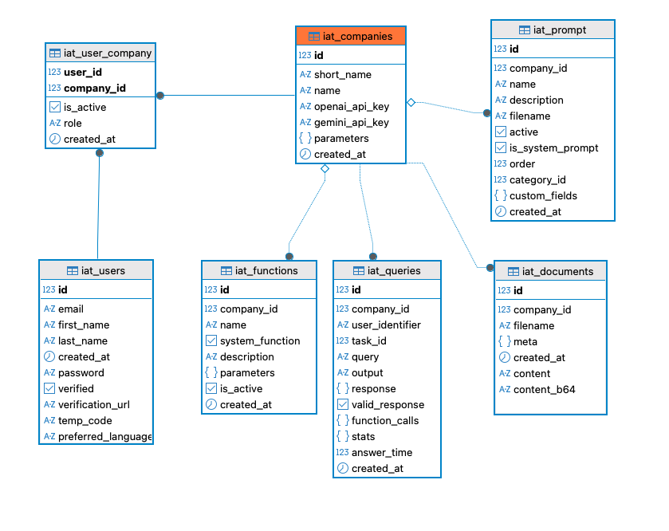

# IAToolkit Database Guide

## 1. Introduction

This guide explains the core data model of **IAToolkit** from a developer’s perspective.  
It is intended to help you:

- Understand how data is organized in the IAToolkit database.
- Safely integrate your own data sources (via `company.yaml` and schema files).
- Extend or query the IAToolkit schema for analytics, debugging, or custom features.

IAToolkit is built on **SQLAlchemy** and typically uses **PostgreSQL** (with optional `pgvector` for semantic search).  
However, the concepts described here apply to any SQL backend supported by SQLAlchemy.

---

## 2. High-Level Overview

At a high level, IAToolkit’s internal database can be thought of in terms of four main domains:

1. **Tenants & Users**
   - Companies
   - Users & Profiles
   - Authentication and sessions

2. **Queries & Conversations**
   - LLM queries and responses
   - Tool calls and execution logs

3. **Documents & Vector Store (RAG)**
   - Uploaded documents and metadata
   - Vector chunks and embeddings

In addition to the **core IAToolkit schema**, each Company can connect to its **own business database** via the `data_sources.sql` section in `company.yaml`. 
Those external databases are **not owned** by IAToolkit; instead, they are *described* using YAML schemas in `companies/<company>/schema/`.

Here is an ER diagram of the main tables in IAToolkit:

---

## 3. Tenant & User Model

### 3.1 Company

**Table:** `iat_companies`  
**SQLAlchemy model:** `iatoolkit.repositories.models.Company`

Represents a tenant (a “Company” or project) within IAToolkit.

Table fields:

- `id` (PK, integer)
- `short_name` (string): Unique identifier, e.g. `"sample_company"`. Used in URLs and routing.
- `name` (string): Human-readable company name.
- `openai_api_key` (encrypted string, optional): Legacy storage for LLM keys.
- `gemini_api_key` (encrypted string, optional): Legacy storage for Gemini keys.
- `parameters` (JSON): Arbitrary per-company configuration (mirrors part of `company.yaml`).

### 3.2 Users and Roles

IAToolkit manages users and their permissions across multiple companies through a normalized structure.

**Tables:**

- `iat_users`: Stores global user information.
- `iat_user_company`: An association table that links users to companies and defines their role within each one.

**SQLAlchemy models:** `User`, `user_company` (table object)

Conceptually:

- The **`iat_users`** table stores authentication-related data that is unique to a user, regardless of the company, such as `id`, `email`, `password` (hashed), and `first_name`.
- The **`iat_user_company`** table connects a user to a company. This allows a single user account to have access across multiple tenants.

### 3.3 Access Log

**Table:** `iat_access_log`  
**SQLAlchemy model:** `iatoolkit.repositories.models.AccessLog`

This table provides a security audit trail by recording every login attempt made to the platform, whether successful or failed.

Key fields:

- `id` (PK)
- `timestamp`: When the access attempt occurred.
- `company_short_name`: The company that was targeted.
- `user_identifier`: The email or username used for the attempt.
- `auth_type`: The method used for authentication (e.g., 'local', 'external_api').
- `outcome`: The result of the attempt ('success' or 'failure').
- `reason_code`: If the attempt failed, a code indicating why (e.g., 'INVALID_CREDENTIALS').
- `source_ip`: The IP address of the client making the request.

This table is used by the `AuthService` to log all authentication events.

---

## 4. Queries, Conversations & Logs

IAToolkit keeps a detailed record of interactions with the LLM and its tools to enable auditing, analytics, and cost tracking.

### 4.1 LLM Query Log

**Table:** `iat_queries`  
**SQLAlchemy model:** `iatoolkit.repositories.models.LLMQuery`

This is one of the most important tables for auditing and debugging. 
It logs every complete interaction with the LLM, including the initial question, the final answer, 
any tools that were used, and performance statistics.

Key fields:

- `id` (PK, Integer)
- `company_id`: Foreign key linking to the `iat_companies` table.
- `user_identifier` (String): The identifier for the user who initiated the query.
- `query` (Text): The original, unmodified question or prompt from the user.
- `output` (Text): The final, user-facing text answer generated by the LLM after all steps were completed.
- `response` (JSON): A JSON blob containing the full, serialized response from the LLM, including any intermediate data. Useful for deep debugging.
- `valid_response` (Boolean): A flag indicating whether the final response was considered successful and valid.
- `function_calls` (JSON): A list of all the tools (functions) that were executed during the conversation turn, including their names and the arguments they were called with.
- `stats` (JSON): A dictionary containing key performance and cost metrics. This typically includes:
    - `input_tokens`: Tokens sent to the LLM.
    - `output_tokens`: Tokens received from the LLM.
    - `total_tokens`: The sum of input and output tokens.
    - `model`: The specific LLM model used (e.g., `gpt-5`).
- `answer_time` (Integer): The total time in seconds from receiving the query to generating the final answer.
- `created_at` (DateTime): The timestamp for when the query was logged.

The **QueryService** and **llmClient** use this table to:

- Log every interaction for auditing purposes.
- Provide data for analytics dashboards on usage and costs.
- Allow developers to replay or debug past conversations by inspecting the full context and tool call sequence.

### 4.2 User Feedback

**Table:** `iat_feedback`  
**SQLAlchemy model:** `iatoolkit.repositories.models.UserFeedback`

This table stores direct feedback from users about the AI's responses, which is critical for monitoring quality and improving performance.

Key fields:
- `id` (PK)
- `company_id`: The company in which the feedback was given.
- `user_identifier`: The user who submitted the feedback.
- `message`: The free-text comment from the user.
- `rating`: A numerical rating (e.g., 1-5 stars) provided by the user.

This table is used by the `UserFeedbackService` to save feedback and trigger notifications.

### 4.3 Prompts and Categories

Prompts are managed in the database to allow for dynamic loading and organization in the user interface.

**Tables:**

- `iat_prompt_categories`: Defines the groups for organizing prompts.
- `iat_prompt`: Represents an individual, reusable prompt template.

**SQLAlchemy models:** `PromptCategory`, `Prompt`

Key fields for **`iat_prompt_categories`**:
- `id` (PK)
- `name`: The user-facing name of the category (e.g., "Sales Analysis").
- `order`: A number that controls the display order in the UI.
- `company_id`: The company this category belongs to.

Key fields for **`iat_prompt`**:
- `id` (PK)
- `name`: The internal identifier of the prompt, which usually matches the `.prompt` filename.
- `description`: The user-facing description shown in the UI.
- `category_id`: A foreign key linking the prompt to its category.
- `custom_fields`: A JSON field defining any extra input fields needed for the prompt.

These tables are used by the `ConfigurationService` during setup and the `PromptManagerService` at runtime to render and manage prompts.

---

## 5. Documents & Vector Store (RAG)

Retrieval-Augmented Generation (RAG) in IAToolkit is backed by two main internal tables:

1. **Document metadata & content** – e.g., `iat_documents`
2. **Vector store entries (chunks + embeddings)** – e.g., `iat_vsdocs`

Together, they allow the system to:

- Store your private documents.
- Chunk them.
- Generate embeddings.
- Search them semantically using `pgvector`.

### 5.1 Document Table: `iat_documents`

Represents a logical document as seen by IAToolkit.

Table fields:

- `id` (PK)
- `company_id` – which company this document belongs to
- `filename` – original file name
- `content` – extracted text, usually as `TEXT`
- `content_b64` – optional base64-encoded content (for binary or large payloads)
- `meta` – JSON with arbitrary metadata (e.g., `{"type": "supplier_manual", "department": "Sales"}`)
- `created_at`, `updated_at`

This table is mapped to a SQLAlchemy model such as `Document` (see `iatoolkit.repositories.models`).

### 5.2 Vector Store Table: `iat_vsdocs`

Represents **chunks** of documents, each with its own embedding vector.

Typical fields:

- `id` (PK)
- `company_id` – tenant scoping
- `document_id` – FK to `iat_documents.id`
- `text` – the chunk of text used for embedding
- `embedding` – vector type (e.g., `vector(1536)` using `pgvector`)

The `VSRepo` (`iatoolkit.repositories.vs_repo.VSRepo`) manages interactions with this table:

- **Insertion** (`add_document`):
  - Breaks a document into chunks (`VSDoc` instances).
  - For each chunk:
    - Computes an embedding via `EmbeddingService`.
    - Stores the result in `iat_vsdocs.embedding`.
- **Query** (`query`):
  - Computes an embedding for the query text.
  - Executes a similarity search using `ORDER BY embedding <-> CAST(:query_embedding AS vector)`.
  - Joins with `iat_documents` to return document-level results.

---

